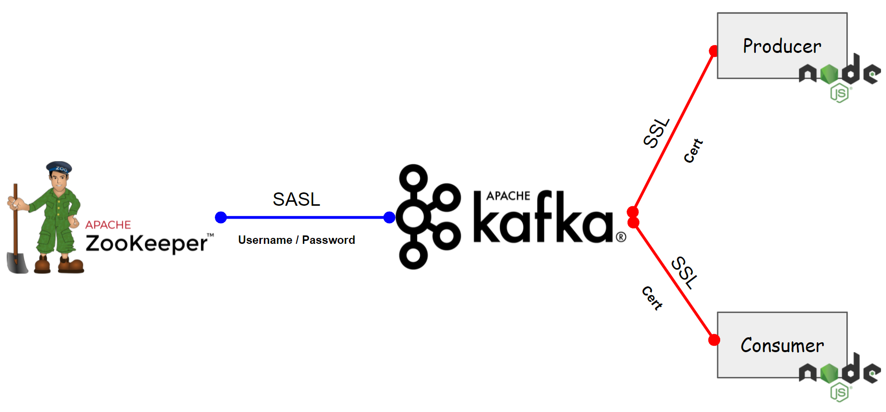
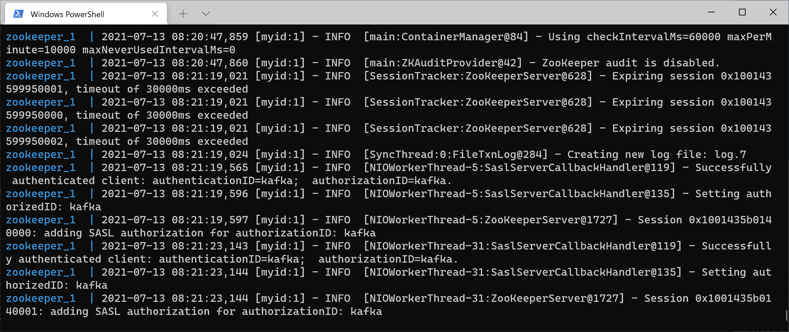
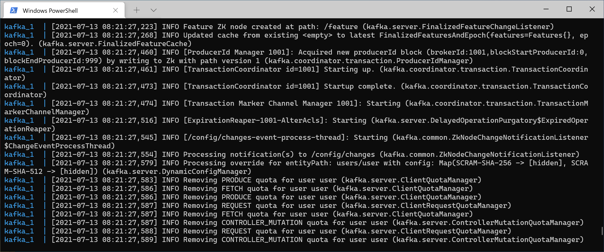
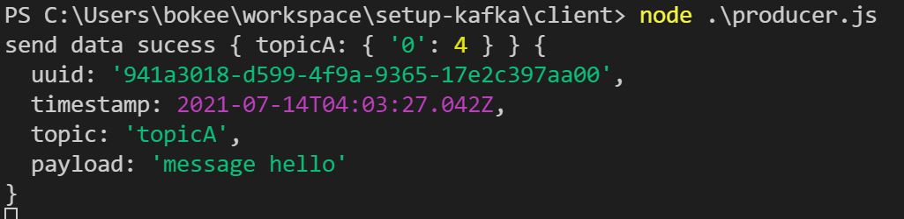
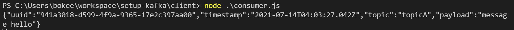

# kafka-security
This example configures Kafka to use TLS/SSL with client connections. You can also choose to have Kafka use TLS/SSL to communicate between producer & consumer.

## Topology



## Steps

### Step 1: Create the Truststore and Keystore

You must also use your own certificates for SSL. You can drop your Java Key Stores or PEM files into /opt/bitnami/kafka/config/certs. If the JKS or PEM certs are password protected (recommended), you will need to provide it to get access to the keystores:


The following script can help you with the creation of the JKS and certificates:
<a href="./cert/kafka-generate-ssl.sh">kafka-generate-ssl.sh</a>

Extract signed client certificate
```sh
keytool -noprompt -keystore kafka.keystore.jks -exportcert -alias localhost -rfc -storepass 'P@ssw0rd!@#' -file cert.pem
```

Extract client key
```sh
keytool -noprompt -srckeystore kafka.keystore.jks -importkeystore -srcalias localhost -destkeystore cert_and_key.p12 -deststoretype PKCS12 -srcstorepass 'P@ssw0rd!@#' -storepass 'P@ssw0rd!@#'
>openssl pkcs12 -in cert_and_key.p12 -nocerts -nodes -passin pass:'P@ssw0rd!@#' -out cert_key.pem
```

Extract CA certificate
```sh
keytool -noprompt -keystore kafka.keystore.jks -exportcert -alias CARoot -rfc -file ca_cert.pem -storepass 'P@ssw0rd!@#'
```

### Step 2: Letting Kafka Read the Keystore and Truststore Files

copy the truststore and keystore to directory where Kafka can read them in the previous step, you must copy them to a final location on the broker. You must also allow the user account you use to run Kafka to read these files. The easiest way to ensure the user's access is to give this user ownership of these files.

<b>kafka.keystore.jks</b>
```
'c:\Users\Bokie\workspace\kafkasec\config\certs\kafka.keystore.jks:/opt/bitnami/kafka/config/certs/kafka.keystore.jks:ro'
```
<b>kafka.truststore.jks</b>
```
'c:\Users\Bokie\workspace\kafkasec\config\certs\kafka.truststore.jks:/opt/bitnami/kafka/config/certs/kafka.truststore.jks:ro'
```
can see at <a href=".\compose\kafka.yaml">kafka.yaml</a> in mount volumes field.

### Step 3: Edit the Kafka Configuration to Use TLS/SSL Encryption

With the truststore and keystore in place, your next step is to edit the Kafka's server.properties configuration file to tell Kafka to use TLS/SSL encryption. This file is usually stored in the Kafka config directory. The location of this directory depends on how you installed Kafka. In this example use docker you can see at <a href=".\compose\kafka.yaml">kafka.yaml</a> have properties overide on yaml file.

config Zookeeper : 
```yaml
- KAFKA_ZOOKEEPER_PROTOCOL=SASL
- KAFKA_CFG_ZOOKEEPER_CONNECT=192.168.88.208:2181
- KAFKA_ZOOKEEPER_USER=kafka
- KAFKA_ZOOKEEPER_PASSWORD=password_zoo
- KAFKA_ZOOKEEPER_TLS_VERIFY_HOSTNAME=false
- KAFKA_CFG_ZOOKEEPER_SET_ACL=false
```

config SSL Kafka :

```yaml
- KAFKA_CFG_LISTENERS=SSL://:9092
- KAFKA_CFG_ADVERTISED_LISTENERS=SSL://192.168.88.208:9092

- KAFKA_CFG_SECURITY_INTER_BROKER_PROTOCOL=SSL
- KAFKA_CFG_SSL_ENDPOINT_IDENTIFICATION_ALGORITHM=
- KAFKA_CFG_SSL_CLIENT_AUTH=required
```

config SSL Kafka Keystore :

```yaml
- KAFKA_CFG_SSL_KEYSTORE_LOCATION=/opt/bitnami/kafka/config/certs/kafka.keystore.jks
- KAFKA_CFG_SSL_KEYSTORE_PASSWORD=P@ssw0rd!@#
- KAFKA_CFG_SSL_TRUSTSTORE_LOCATION=/opt/bitnami/kafka/config/certs/kafka.truststore.jks
- KAFKA_CFG_SSL_TRUSTSTORE_PASSWORD=P@ssw0rd!@#
- KAFKA_CFG_SSL_PASSWORD=P@ssw0rd!@#
```

### Step 4: Start Your Kafka

start with docker-compose up in zookeeper, kafka

```sh
docker-compose -f zookeeper.yml up -d
```



```sh
docker-compose -f kafka.yml up -d
```



### Step 5: Try Client Connect to Kafka

start node producer , & consumer

properties config in js
```js
var fs = require('fs');

var kafkaClientOption = {
    clientId: 'user',
    kafkaHost : '192.168.88.208:9092',
    ssl: true,
    sslOptions: {
      rejectUnauthorized: false,
      ca: [fs.readFileSync('./cert/ca_cert.pem', 'utf-8')],
      cert: [fs.readFileSync('./cert/cert.pem', 'utf-8')],
      key: [fs.readFileSync('./cert/cert_key.pem', 'utf-8')],
    },
    autoConnect: true,
    connectTimeout: 1000,
    requestTimeout: 1000
}
  
var client = new kafka.KafkaClient(kafkaClientOption);
```

Run Client Apps

```sh
node producer.js
```



```sh
node consumer.js
```


